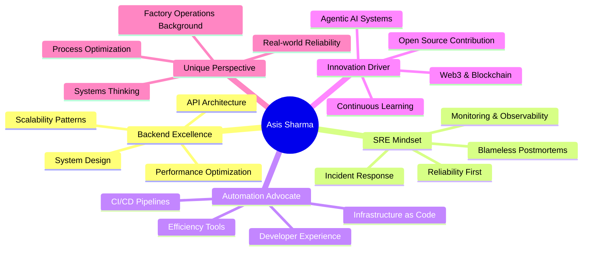

<div align="center">

<!-- Animated Header -->


<!-- Typing SVG -->
<a href="https://git.io/typing-svg"></a>

<br/>

<!-- Animated badges -->


</div>

<br/>

<!-- About Me Section with animated GIF -->


### 👨‍💻 About Me

```python
class AsisShama:
    def __init__(self):
        self.username = "asissharma"
        self.role = "Backend Developer & SRE"
        self.education = "BCA Graduate"
        self.location = "Jaipur, Rajasthan, India"
        self.background = "Factory Operations → Software Engineering"
        
    def get_expertise(self):
        return {
            "backend": ["System Design", "API Architecture", "Microservices"],
            "sre": ["Reliability Engineering", "Monitoring", "Incident Response"],
            "automation": ["CI/CD", "Infrastructure as Code", "Developer Tools"],
            "interests": ["Agentic AI", "Web3", "Open Source"]
        }
    
    def current_focus(self):
        return [
            "Building intelligent automation tools",
            "Optimizing developer workflows",
            "Exploring agentic AI systems",
            "100 Days of Web3 Challenge"
        ]
```

<br clear="right"/>

---

<!-- Tech Stack with animated icons -->
<h2 align="center">
   
  Tech Arsenal
</h2>

<div align="center">

### Languages
<p>
  
  
  
  
</p>

### Backend & Infrastructure
<p>
  
  
  
  
  
  
</p>

### DevOps & SRE
<p>
  
  
  
  
  
</p>

### Exploring
<p>
  
  
  
</p>

</div>

---

<!-- Projects Section -->
<h2 align="center">
  
  Featured Projects
</h2>

<div align="center">

<table>
<tr>
<td width="50%">

### 🐍 [python-100-down](https://github.com/asissharma/python-100-down)
**Web-Based Python Script Manager**


```yaml
Stack: Python, Web Frameworks
Mission: Transform CLI scripts → Web Tools
Status: 🚀 Active Development
Impact: Democratizing Python automation
```

</td>
<td width="50%">

### 🛠️ [auto-dev-env](https://github.com/asissharma/auto-dev-env)
**AI-Powered Environment Setup**


```yaml
Stack: Bash, AI Models
Mission: Zero-config dev environments
Status: ⚡ In Progress
Impact: Hours saved per setup
```

</td>
</tr>

<tr>
<td width="50%">

### 🌐 [100-days-web3](https://github.com/asissharma/100-days-web3)
**100 Projects Challenge**


```yaml
Stack: Blockchain, Smart Contracts
Mission: Master Web3 through building
Status: 🔥 Active Challenge
Impact: Rapid skill acceleration
```

</td>
<td width="50%">

### 🎯 Coming Soon...
**Next Innovation**


```yaml
Stack: To Be Determined
Mission: Push boundaries further
Status: 💭 Ideation Phase
Impact: Watch this space!
```

</td>
</tr>
</table>

</div>

---

<!-- GitHub Stats -->
<h2 align="center">
  
  GitHub Analytics
</h2>

<div align="center">
  


</div>

<!-- Trophy Section -->
<div align="center">
  


</div>

---

<!-- Philosophy Section -->
<h2 align="center">
  
  Engineering Philosophy
</h2>

<div align="center">



</div>

---

<!-- Activity Section -->
<h2 align="center">
  
  Recent Activity
</h2>

<div align="center">

<!--START_SECTION:activity-->
<!--END_SECTION:activity-->

<!-- GitHub Activity Graph -->


</div>

---

<!-- Contribution Snake -->
<div align="center">
  <h2>Contribution Snake 🐍</h2>
  
  <picture>
    <source media="(prefers-color-scheme: dark)" srcset="https://raw.githubusercontent.com/asissharma/asissharma/output/github-contribution-grid-snake-dark.svg">
    <source media="(prefers-color-scheme: light)" srcset="https://raw.githubusercontent.com/asissharma/asissharma/output/github-contribution-grid-snake.svg">
    
  </picture>

</div>

---

<!-- Connect Section -->
<h2 align="center">
  
  Let's Connect & Build Together
</h2>

<div align="center">

[](https://i-am-here-six.vercel.app/)
[](https://www.linkedin.com/in/asis-sharma/)
[](https://github.com/asissharma)
[](mailto:your.email@example.com)

<br/>

### 💭 Random Dev Quote


<br/>

### 😂 Developer Humor


</div>

---

<!-- Footer -->
<div align="center">

### 🌟 "From factory floors to cloud infrastructure, building systems that never sleep" 🌟


<p align="center">
  
</p>

**⭐ From [asissharma](https://github.com/asissharma) | Built with 💙 and ☕**

</div>
